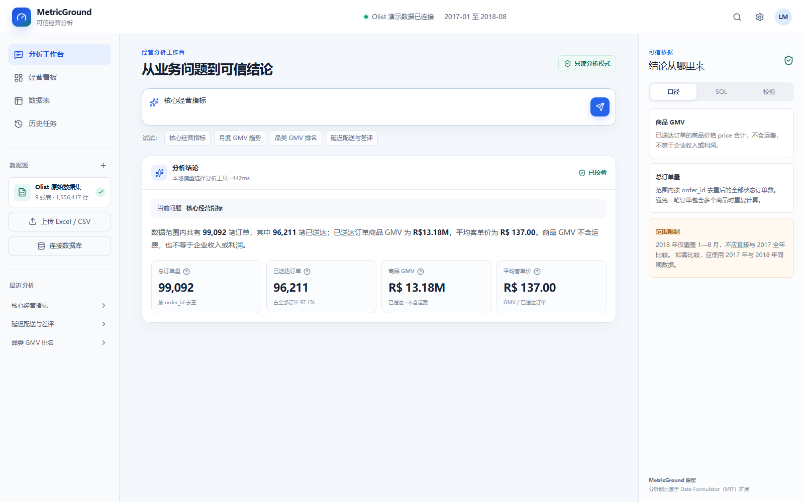
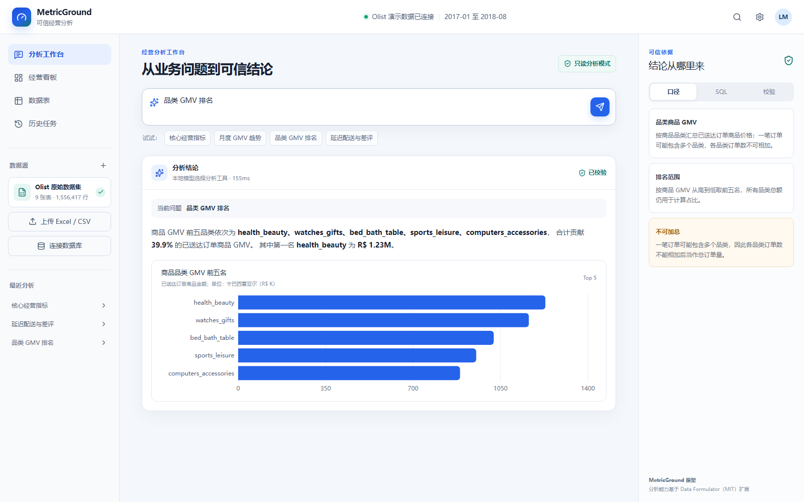
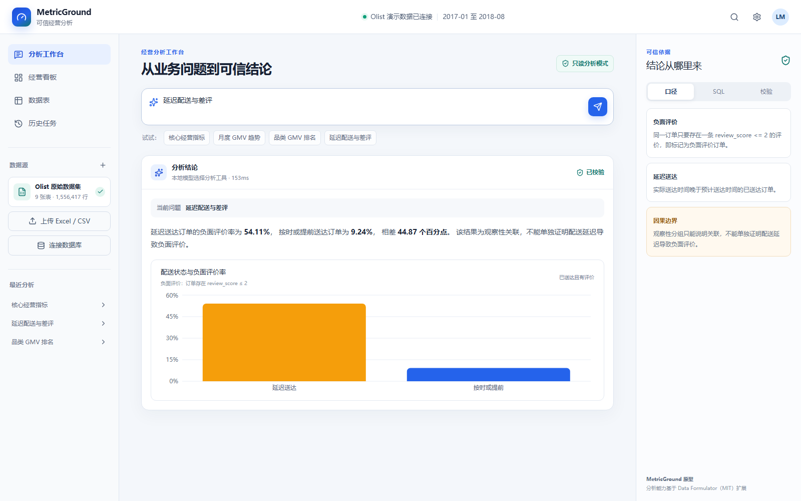

# MetricGround｜初级数据分析师可信分析工作台

MetricGround 面向使用 Excel/CSV 完成常见经营分析的初级数据分析师，提供数据理解、质量检查、指标口径确认、受控计算和结果验证。通用上传数据支持本地 Agent 规划、人工确认、确定性执行、TaskRun 状态追踪与证据导出；Olist 只作为内置演示数据，不再替代用户上传文件的分析结果。

> **交付状态（2026-10-10）**：`v0.3.6` 已部署到 [公开新人测试环境](https://metricground.chirpyseed1.chatgpt.site)，Sites 版本 10。根据实际交付文件补齐报告口径、风险判断快照、规划来源、精确聚合结果、完整 DuckDB SQL 与参数，并修复连续导出触发的保存竞态。[完整 CI 38052790794](https://github.com/LMM1234556/metricground/actions/runs/38052790794) 已通过，包含同任务报告/JSON 下载、持久化、刷新恢复及匿名隔离；详见 [本轮验收记录](evaluation/evidence-export-v0.3.6-2026-10-10.md)。受限 qwen-plus 开关与全站累计二十次请求限制保持不变，本轮没有新增付费模型请求；旧任务缺失信息不会回填，不宣称任意自然语言准确率或生产 SLA。



## 为什么做这个项目

业务人员面对 Excel、CSV 或数据库时，常遇到三个问题：不知道如何把业务问题转换成分析步骤；订单表与商品表粒度不同，容易重复统计；结果缺少指标口径和数据边界，难以判断是否可信。

本项目没有让大模型直接“猜数字”，而是把能力拆分为：

```text
自然语言问题
  → 规则路由 / 可选模型识别意图并提出候选字段
  → AnalysisSpec + 人工确认
  → 白名单确定性工具（主计算）
  → DuckDB-WASM 独立 SQL 复算
  → TaskRun + 结论 + 图表 + 口径 + SQL + 证据包
```

## 已实现功能

- 支持核心经营指标、月度 GMV 趋势、指标与趋势组合、品类 GMV 排名、配送延迟与评价关系等 5 类分析任务；
- 对退款、利润、库存、预测等尚未接入的问题明确拒答，不用无关默认结果替代；
- 已实现可选本地 Ollama + Qwen3:8b 的意图规划接入；公开站点当前为受限 qwen-plus 云端试验，非全面开放；
- 规则支持部分口语计数、金额排名与质量风险问法；缺少用户要求的字段时停在澄清态，不用其他字段替代；
- 模型不可用、超时或输出不合法时，自动切换到关键词规则兜底；
- 云模型试验仅允许 `qwen-plus`，D1 全站累计二十次实际 HTTP 请求、每问题两次、输出 512 Token、输入请求 24KB，关闭自动重试与思考；记录模型调用用量摘要。达到上限停止云调用并安全兜底，限制不是人民币硬上限；
- 支持在浏览器本地读取 CSV/XLSX，展示工作表、行列数、字段类型、缺失率、唯一值、样例与候选数据粒度；
- 对上传数据检查完全重复行、标识字段重复、缺失值、混合类型、无效日期和 IQR 数值异常，并展示证据、影响与建议；
- 对数据处理建议记录“暂不处理/批准后续处理”的人工决定；在独立清洗页二次确认后，只对派生副本执行完全重复、指定字段缺失和无效日期三类白名单规则；
- 清洗后自动重新运行质量检查，展示清洗前后行数、问题数和逐项删行记录，并保证后续指标合同和计算绑定同一数据版本；
- 支持计数、金额/总量、平均值和比例 4 类指标口径确认，动态选择统计对象、数值字段、时间字段与筛选范围；
- 关键定义或人工确认缺失时阻止生成结果，并把未处理的数据质量风险写入可下载的指标口径合同；
- 支持结构化字段筛选与参数化执行计划，禁止把自然语言直接拼接成任意查询；
- 基于浏览器本地确定性引擎执行计数、求和、平均值和比例预览；再由 DuckDB-WASM 使用独立 SQL 复算指标值、参与行数、去重对象、排除记录和比例边界，复核不通过时阻止 TaskRun 完成；
- 支持通用上传数据的分组比较、日/周/月/季度趋势和 Top N，字段与口径确认后才执行；
- 使用统一 `AnalysisSpec` 记录统计对象、数值字段、分组、时间、筛选、粒度、假设和数据版本；
- 使用 `TaskRun` 状态机记录计划、工具调用、人工审批、执行结果、验证结论和失败原因，非法跳步会被阻止；
- TaskRun 以 `traceId`、幂等键和乐观修订号持久化到 D1；上传数据和完整工作区仅存当前浏览器 IndexedDB，刷新后可恢复且服务端不接收原始数据行；
- API 使用 D1 固定窗口限流、同源写入检查、请求体上限、结构化请求日志和请求 ID；CSV/XLSX 增加文件大小、类型、空字节、10 万行和 200 列边界；
- 可选开启 Sites 注入身份的 TaskRun 所有者隔离；开启 `METRICGROUND_REQUIRE_AUTH=true` 后，未登录用户无法提交受保护 API，界面会显示登录入口；
- 临时公开测试使用 `METRICGROUND_REQUIRE_AUTH=false` 和 `METRICGROUND_ANONYMOUS_SESSIONS=true`，通过 HttpOnly 匿名 Cookie 隔离 TaskRun；缺少会话时核心 API 拒绝执行，匿名限流仍按 IP 计算；
- 提供本地 D1 导出、SHA-256 清单和隔离目录恢复演练，恢复后逐表核对 TaskRun、幂等写入与所有者绑定数量；
- 已实现最多 3 张表、单键或双字段复合键、`left/inner join` 的受控关联核心；识别 `1:1`、`1:N`、`N:1`，默认阻止 `N:N`；
- 已开放交互式多文件关联页，可上传关联表、查看键覆盖率/孤儿键/行数膨胀预估，确认关系与结果粒度后再执行，并将派生数据版本继续交给后续画像、口径和计算；三表场景按两步向导逐条锁定关系与审批记录；
- 对关联中的金额候选字段执行来源行级对账，分别记录源表合计、关联后合计、重复源行、排除源行和净差额；风险随派生数据版本传递，未守恒字段的求和与平均计算会被确定性规则阻止；
- 支持导出不含原始数据行的 Agent 证据包，并使用校验和发现导出内容被篡改；
- 模型适配器优先尝试本地 Ollama；可显式配置 Groq 或阿里云百炼 DashScope 降级，云模型不接收原始明细行；接入代码不等于公开站点已运行模型；
- 基于 9 张 Olist CSV、1,556,417 行原始记录生成只读分析快照；
- 在订单与商品一对多关系中先聚合到一行一订单，防止订单量和均值被放大；
- 内置 8 项数据质量与结果对账检查，并在界面展示指标定义、SQL 和边界说明；
- 对 2018 年仅覆盖至 8 月、GMV 不含运费、观察性关联不能证明因果等风险主动提示。

## 示例结果

| 场景 | 结论示例 | 可信边界 |
|---|---|---|
| 核心经营指标 | 99,092 笔订单，96,211 笔已送达；商品 GMV R$13.18M | GMV 为已送达订单商品金额，不含运费，不等于收入或利润 |
| 月度趋势 | 2017-11 达到范围内高点 R$987.8K | 2018 年只有 1—8 月，不能直接与 2017 全年比较 |
| 品类排名 | 前五品类合计贡献 39.9% 商品 GMV | 一笔订单可能包含多个品类，品类订单数不可直接相加 |
| 配送评价 | 延迟订单负面评价率 54.11%，按时或提前为 9.24% | 观察性结果只能说明关联，不能单独证明因果 |

<details>
<summary>查看更多界面</summary>

### 品类 GMV 分析



### 配送与评价分析



</details>

## Agent 可信机制

1. **模型只负责理解**：识别意图、候选字段和澄清问题，不计算最终数字。
2. **统一分析合同**：`AnalysisSpec` 绑定字段、粒度、筛选、口径和数据版本。
3. **确定性执行**：程序执行质量检查、清洗、聚合、趋势、排名与关联，不运行任意自然语言代码。
4. **高风险人工确认**：粒度、金额范围、分子分母、清洗和关联关系必须由用户确认。
5. **独立复核与证据**：DuckDB-WASM 以独立 SQL 复算关键结果；`TaskRun` 记录引擎版本、数据版本、SQL、勾稽检查、审批和失败，可导出证据包。
6. **失败降级与拒答**：模型不可用时使用规则；字段不存在、口径不完整、多对多或能力未覆盖时阻止执行。

详细说明见 [当前能力与证据矩阵](docs/capability_matrix.md)、[Agent V1 设计](docs/agent_design_v1.md)、[Agent 架构](docs/agent_architecture.md)、[指标定义](business_context/metric_definitions.yaml) 和 [数据来源与复算流程](docs/data_provenance.md)。

## 固定题集测评

建立 30 道中文自然语言问题，覆盖 6 类意图，每类 5 题；使用同一题集对比关键词规则和本地 Qwen 路由。

| 指标 | 关键词规则 | Qwen3:8b |
|---|---:|---:|
| 意图准确率 | 60.0% | 100.0% |
| 暂不支持问题召回率 | — | 100.0% |
| 热启动平均响应时间 | — | 约 170 ms |

准确率提升为 **40 个百分点**。这是一组项目自建的小规模功能回归题集，不代表模型在所有开放问题上的泛化准确率。题目、逐题结果和脚本分别位于 `evaluation/intent_cases.json`、`evaluation/results-latest.json` 和 `frontend/scripts/evaluate-intent-routing.mjs`。

此外建立通用工作台 30 项固定任务，覆盖销售订单、客户营销、库存运营 3 种 CSV 结构，以及字段画像、质量发现和四类指标计算。30/30 通过，计算结果与独立 pandas 3.0.2 参考脚本一致。这仍是小规模功能回归，不代表适用于所有公司数据。报告见 `evaluation/workbench-report-latest.md`，参考脚本见 `evaluation/reference_metrics.py`。

## 技术栈

- Agent：Qwen3:8b、Ollama、结构化 JSON 输出、白名单工具路由、规则降级；
- 数据：Python、pandas、DuckDB-WASM、Cloudflare D1、IndexedDB、SQL、YAML 指标口径、JSON 分析快照；
- 前端：React 19、TypeScript、Vinext/Vite、Recharts、Lucide；
- 验证：数据对账脚本、30 题意图评测、Chrome DevTools Protocol 端到端回归。

## 五分钟本地运行

### 1. 安装并启动

要求 Node.js 22.13 或更高版本。

```powershell
cd frontend
npm install
npm run dev
```

打开 `http://localhost:5173/`。没有安装模型时，系统会使用安全的规则路由完成受支持任务；这不会绕过指标确认、确定性计算和结果验证。

`npm run dev` 和 `npm run build` 会先执行 `npm run sync:duckdb`，把固定版本 `@duckdb/duckdb-wasm@1.32.0` 的 Worker 与 WASM 压缩为同源 `/duckdb` 资源。浏览器优先加载同源压缩文件；只有不支持 `DecompressionStream` 时才回退到固定版本 jsDelivr。可通过 `NEXT_PUBLIC_DUCKDB_ASSET_BASE_URL` 覆盖资源根路径。

### 2. 可选：启用本地模型

安装 Ollama 后执行：

```powershell
ollama pull qwen3:8b
ollama serve
```

可通过环境变量替换模型或服务地址：

```powershell
$env:OLLAMA_MODEL = "qwen3:8b"
$env:OLLAMA_BASE_URL = "http://127.0.0.1:11434/v1"
```

仓库已包含可演示的只读数据快照。如需从原始 Olist CSV 重新复算，请把 9 张 CSV 放入同一目录，然后执行：

```powershell
python -m venv .venv
.\.venv\Scripts\python.exe -m pip install -r requirements.txt
.\.venv\Scripts\python.exe .\scripts\prepare_olist_snapshot.py `
  --source-dir "D:\path\to\olist-csv"
```

### 3. 运行交付验证

```powershell
cd frontend
npm run test:release
```

浏览器回归需要先运行开发服务，并打开一个使用远程调试端口 `9224` 的 Chromium/Edge 页面，然后执行：

```powershell
npm run test:release:browser
```

新人测试材料位于 `evaluation/novice_test_files/`；参与者任务单、主持人方案与记录表分别位于 `evaluation/novice_usability_participant_brief.md`、`evaluation/novice_usability_test_protocol.md` 和 `evaluation/novice_usability_observation.csv`。

## 项目结构

```text
business_context/     指标口径与业务定义
docs/                 架构、数据来源、演示与截图
evaluation/           固定题集和逐题测评结果
frontend/app/         React 页面、模型路由接口、只读数据快照
frontend/scripts/     意图评测与浏览器回归脚本
scripts/              Olist 数据复算和基线启动脚本
```

## 版本与持续集成

项目从 `v0.1.0` 开始保留真实版本历史，不补写早期提交。GitHub Actions 将测试分为两层：

- `npm run test:ci:static`：代码规范、类型、构建和不依赖运行服务的确定性测试；
- `npm run test:ci:browser`：在生产构建的本地预览和 Chromium 调试端口上运行 API 场景、文件、质量、计算、关联和新人引导回归。
- `npm run test:execution:mobile`：在移动端视口、冷缓存和模拟 4G 网络下复跑受控计算与 DuckDB 独立复核。

版本变化见 [CHANGELOG](CHANGELOG.md)，当前基线见 [v0.3.2 版本说明](docs/releases/v0.3.2.md) 和 [匿名上线验证](evaluation/anonymous-access-validation-v0.3.2-2026-10-10.md)，历史移动端外部身份证据见 [v0.3.1 线上验证](evaluation/mobile-external-validation-v0.3.1-2026-10-09.md)，双账号隔离证据见 [线上身份隔离验证](evaluation/hosted-identity-isolation-2026-10-09.md)，生产化边界和验收标准见 [生产化与迭代路线](docs/production_roadmap.md)。

## 项目边界与后续计划

当前版本仍是 MVP，不是生产级企业数据平台。页面已支持字段画像、质量检查、清洗派生副本、口径合同、计数/求和/平均/条件比例、分组、趋势、Top N、TaskRun、证据导出，以及最多三张表的受控关联。TaskRun 已持久化，刷新可恢复；当前公开环境临时使用浏览器匿名会话隔离，Cookie 有效期为 7 天，同一浏览器配置的标签页共享身份。清除 Cookie、过期或恢复强制登录后，匿名记录不能按账号找回或自动迁移；参与者必须在结束前下载报告。角色权限和团队空间尚未实现，原始数据不会跨设备同步。主计算仍在浏览器确定性引擎内完成，DuckDB-WASM 从同一数据版本使用独立 SQL 复算；这能发现计算实现、行数范围和边界不一致，但不能替代业务口径确认，也不是对源数据真实性的外部审计。当前比例不支持任意两个聚合量之比；数据库源连接、服务端文件存储、完整 APM/值班体系和正式目标用户测试仍未完成。

交付入口见 `docs/release_handoff.md`。最小失败告警已经启用，失败、去重、升级与恢复的隔离状态机演练已进入 CI；健康运行按设计保持静默，真实故障发生时再保留通知送达记录，不以此阻塞用户测试。当前下一阶段是邀请 5 名目标用户完成无指导任务测试，之后只根据真实失败点决定是否增加通用比例、非常规金额字段指定和复杂 Excel 支持。当前自动化任务验收见 `evaluation/junior_analyst_task_assessment.md`，现状与边界以 `docs/capability_matrix.md` 为准；旧差距审计仅保留为历史快照。

## 上游说明

项目复现 Microsoft Data Formulator 0.7.0（MIT License）作为可视化探索基线，并参考其交互思路。当前 MetricGround 前端、质量规则、口径合同、清洗闭环、受控计算和评测为独立实现，运行时不依赖 Data Formulator 服务。

本仓库目前公开可见，但尚未选择开源许可证；公开访问不等于授予复制、修改或再分发权。

- Microsoft Data Formulator: https://github.com/microsoft/data-formulator
- 固定基线依赖：`data-formulator==0.7.0`
